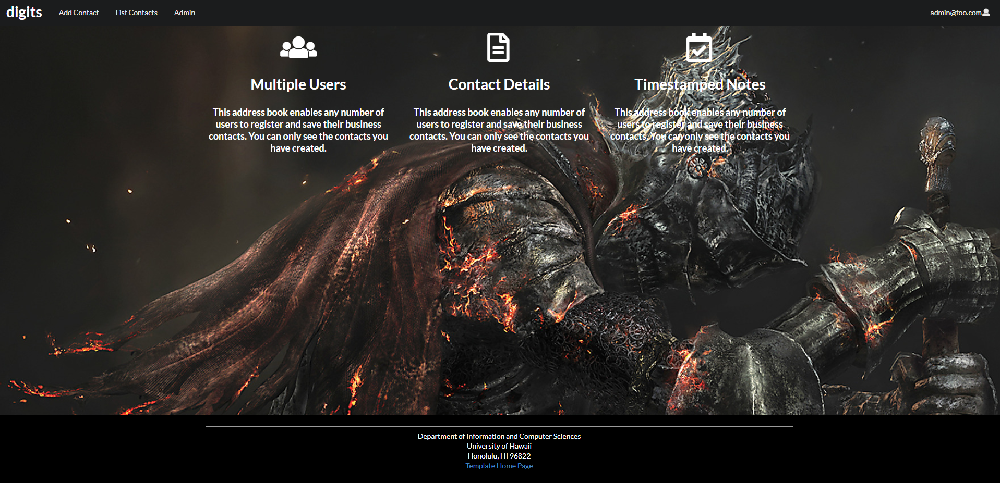
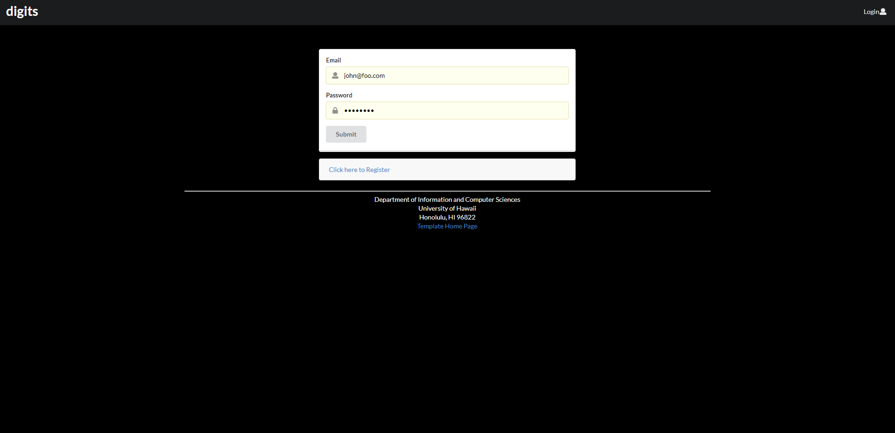
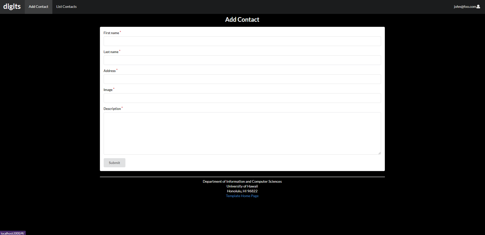
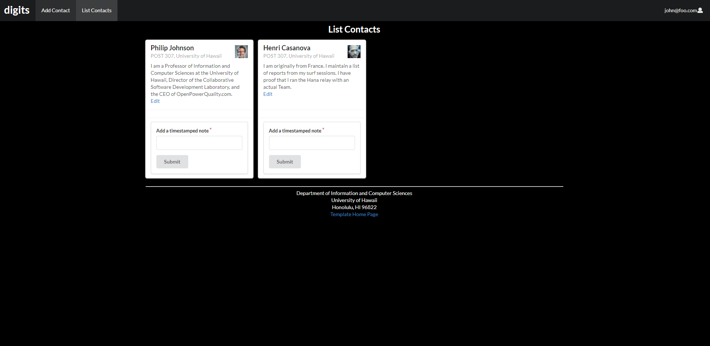
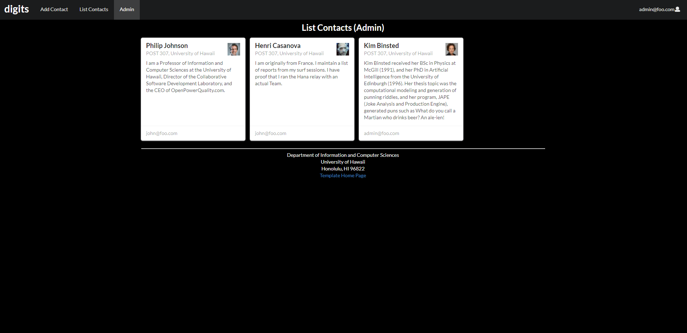

Digits is an application that allows you to keep track of your contacts.


# Installation

First, download the source code. 

Then run < meteor npm install > inside the app directory, followed by < meteor npm run start >. 

The first time you run the app, it will create some default users and data. Here is the output:

```
meteor npm run start

> meteor-application-template-react@ start /Users/philipjohnson/github/philipmjohnson/digits/app
> meteor --no-release-check --settings ../config/settings.development.json

[[[[[ ~/github/philipmjohnson/digits/app ]]]]]

=> Started proxy.                             
=> Started MongoDB.                           
I20180305-18:06:02.764(-10)? Creating the default user(s)
I20180305-18:06:02.803(-10)?   Creating user admin@foo.com.
I20180305-18:06:02.803(-10)?   Creating user john@foo.com.
I20180305-18:06:02.804(-10)? Creating default contacts.
I20180305-18:06:02.804(-10)?   Adding: Johnson (john@foo.com)
I20180305-18:06:02.804(-10)?   Adding: Casanova (john@foo.com)
I20180305-18:06:02.804(-10)?   Adding: Binsted (admin@foo.com)
=> Started your app.

=> App running at: http://localhost:3000/
W20180305-18:06:02.805(-10)? (STDERR) Note: you are using a pure-JavaScript implementation of bcrypt.
W20180305-18:06:02.805(-10)? (STDERR) While this implementation will work correctly, it is known to be
W20180305-18:06:02.806(-10)? (STDERR) approximately three times slower than the native implementation.
W20180305-18:06:02.806(-10)? (STDERR) In order to use the native implementation instead, run
W20180305-18:06:02.806(-10)? (STDERR) 
W20180305-18:06:02.806(-10)? (STDERR)   meteor npm install --save bcrypt
W20180305-18:06:02.806(-10)? (STDERR) 
W20180305-18:06:02.806(-10)? (STDERR) in the root directory of your application.
```

Then go to http://localhost:3000/ and the app should start!


# Landing Page
 
 A page that specifies the specifics of the app and provides a basic overview.
 
 
 
# User Home Page

This page is exactly the same as the Landing page, except it also has a navbar which will take you to the Add Contact and List Contacts pages.

 
 
# Sign In Page
 
 A page that allows returning users to sign in.
 
 
 
# Sign Up Page
 
 A page that allows new users to sign up.
 
 
 
# Add Contact
 
 A page that allows users who have signed in to add new contacts they may have.
 
 
 
# List Contact
 
 A page where returning users can see a list of their contacts, each on its own card.
 
 
 
# Admin Page
 
 A page where the admin can look at all contacts in the system.
 
 
